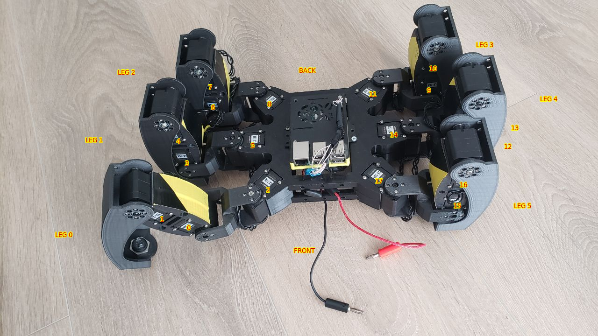
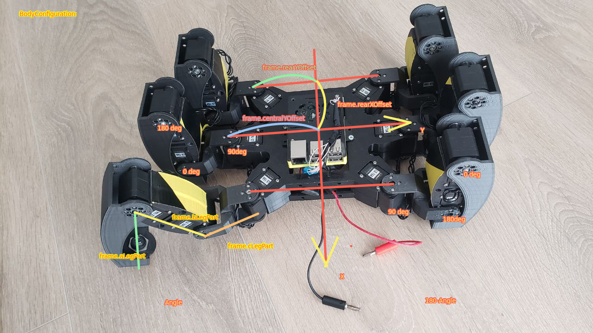

# hexapod_kinematics
 This is a library to calculate hexapod robot movement

 Here the pictures provides schematic body sizes and servo numbers



Attention to angles for current legs position on a photo
Right motor angles are mirrored in comparation with left




 You need to create instance of Platorm class and pass there 2 functors
 -one for setting angle to joint 
 -and one for system specific sleep in ms.

Here is a simplest code to make robot move forward:
```C++
#include "../../hexapod_kinematics/src/platform.hpp"
#include <chrono>

void setServo(int id, double angle)
{
    if(id>8) angle = 180 - angle; //This line is important as right motors moves mirrored to left
    yourFunctionToControlServoAngle(id,angle); //id is a servo number [0..17], angle is a servo position [0 to 180]
}

void sleepMs(int sleepTime)
{
    using namespace std::chrono_literals;
    std::this_thread::sleep_for(std::chrono::milliseconds(sleepTime));
}

int main(int argc, char *argv[])
{
    hexapod::Platform platform(&sleepMs, &setServo);
    platform.setVelocity({1, 0}, 0); //front,side,rotation, {0,0},1 means rotate on place
    platform.startMovementThread(); 
    ...wait here...
}

```
Click to see video of robot movement

[](https://www.youtube.com/watch?v=D592nCSn1s0)